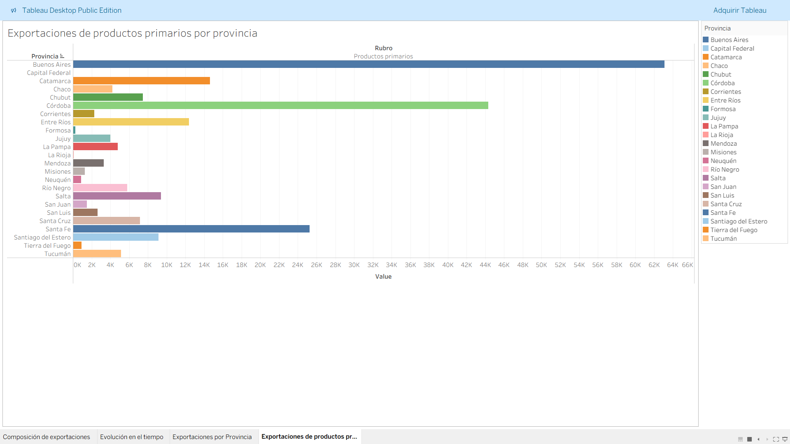
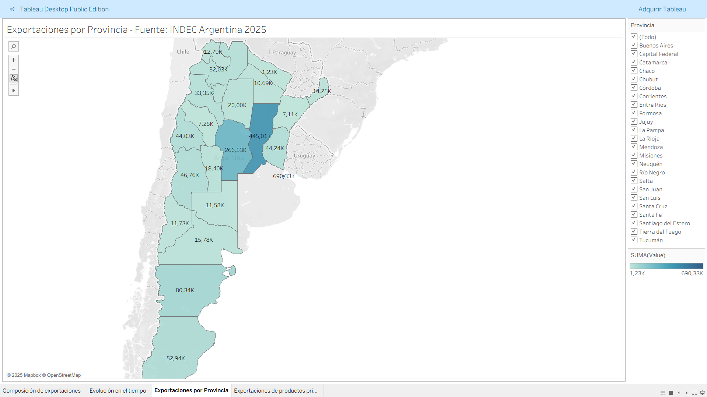

# An lisis y Visualizaci¢n de Datos 
 
## Proyecto Final: Dashboard Exportaciones Argentinas API 
 
Dashboard interactivo con datos reales de exportaciones argentinas (2020-2025), obtenido v¡a API INDEC. 
Incluye 4 visualizaciones: composici¢n por provincia, evoluci¢n temporal, mapa geogr fico y productos primarios. 
 
### Archivos clave 
- Dashboard descargable: [Dashboard Exportaciones Argentina API 1.twbx](./Dashboard%%20Exportaciones%%20Argentina%%20API%%201.twbx) 
- Explicaci¢n detallada: [API1_Govea-Eduardo.pdf](./API1_Govea-Eduardo.pdf) 
 
### Capturas 
 
 
 
Tecnolog¡as: Tableau Desktop, API comercio exterior, extractos .hyper. 
 
M s detalles en el PDF adjunto. 
